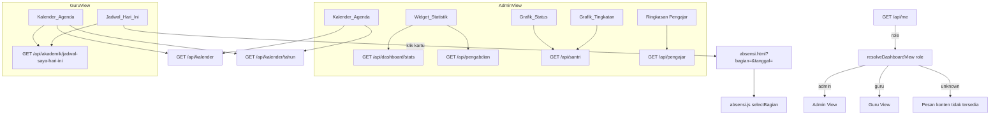

# Design Document

## Overview

Fitur "Dashboard Redesign & Kalender" merancang ulang halaman utama (`frontend/index.html` + `frontend/src/js/main.js`) menjadi Dashboard yang **sadar-peran (role-aware)**, memperkenalkan tema warna terpusat **"Teal Tenang"**, dan menambahkan dua widget baru: **Jadwal Hari Ini** (dengan deep-link ke Input Absensi) dan **Kalender & Agenda** (berbasis data `kalender_kuartal` yang sudah ada).

Prinsip desain utama:

- **Tanpa endpoint baru, tanpa tabel baru.** Seluruh data ditarik dari endpoint yang SUDAH ADA: `GET /api/dashboard/stats`, `GET /api/akademik/jadwal-saya-hari-ini`, `GET /api/santri`, `GET /api/pengabdian`, `GET /api/pengajar`, `GET /api/kalender`, dan `GET /api/kalender/tahun`.
- **Tanpa pustaka chart pihak ketiga.** Grafik Distribusi Tingkatan (bar) dan Komposisi Status (donut) dirender dengan CSS murni (`linear-gradient`/`conic-gradient` + flexbox).
- **Token warna terpusat.** Seluruh warna primer, hover, hero gradient, background, dan aksen didefinisikan sebagai token pada blok `@theme` di `frontend/style.css`, dan seluruh halaman merujuk token tersebut alih-alih menuliskan nilai heksadesimal secara langsung.
- **Reuse RBAC yang ada.** Logika peran memakai `MENU_ACCESS`/`isAdminRole` di `frontend/src/js/xss.js` dan RBAC absensi backend; fitur ini hanya memanfaatkannya.
- **Progressive rendering + graceful degradation.** Setiap widget memuat datanya secara independen; kegagalan satu widget tidak menjatuhkan widget lain, dan menyediakan aksi "muat ulang".

### Ringkasan Riset & Temuan

Riset dilakukan langsung terhadap basis kode agar desain konsisten dengan pola yang ada:

1. **Struktur peran (RBAC).** `frontend/src/js/xss.js` sudah mendefinisikan `MENU_ACCESS` (sumber kebenaran tunggal) dan `window.isAdminRole(role)` yang menilai `role === 'pimpinan' || role === 'admin'`. Peran yang tersedia: `pimpinan`, `admin`, `mufatish`, `mustahiq`, `munawwib`, `wali_santri`. Pemetaan ke istilah requirement:
   - **Peran_Admin** = `pimpinan`, `admin`, dan `mufatish` (mufatish memiliki akses baca statistik/grafik sesuai Glossary).
   - **Peran_Guru** = `mustahiq`, `munawwib`.
   - `wali_santri` sudah punya alur `renderWaliHome()` tersendiri dan berada di luar cakupan Peran_Admin/Peran_Guru (dashboard beranda wali tetap seperti sekarang).
2. **Endpoint jadwal.** `handlers/jadwal.go` → `GetJadwalSayaHariIni` mengembalikan `{ hari: string, jadwal: JadwalHariIni[] }`, dengan `JadwalHariIni { id, bagian_id, nama_bagian, tingkatan, kelas, mapel_id, nama_mapel, hari, jam_mulai, jam_selesai }`. `jam_mulai`/`jam_selesai` sudah berformat `HH:MI` dari SQL dan hasil query sudah `ORDER BY j.jam_mulai`. Backend hanya mengembalikan jadwal milik pengajar yang login (RBAC), sehingga widget tidak perlu memfilter ulang milik guru lain.
3. **Deep-link Absensi.** `frontend/src/js/absensi.js` sudah mengekspos fungsi `selectBagian(bagianId)` yang mengatur cascade `filter-kelas` → `filter-bagian` dan memuat form. Namun `absensi.js` **belum** membaca query param URL. Desain menambahkan pembacaan `?bagian=&tanggal=` saat inisialisasi.
4. **Sumber kalender.** `absensi.js` sudah memakai `/api/kalender` yang mengembalikan array objek `{ kuartal, tahun_ajaran, tgl_mulai, tgl_selesai }`. Widget Kalender_Agenda memakai sumber yang sama.
5. **Tema & CSS.** `frontend/style.css` sudah memakai blok `@theme` Tailwind v4 dengan token seperti `--color-primary`. Saat ini nilainya biru (`#2B5BDB`). Desain mengganti nilai token ke palet Teal Tenang dan menambahkan token hero gradient + aksen gold, sehingga perubahan warna menyebar ke seluruh halaman yang sudah merujuk token.
6. **Pola pengujian.** Repo memakai Vitest + fast-check + jsdom (`frontend/tests/*.property.test.js`), mengimpor fungsi murni yang diekspor dari modul, lalu memverifikasi properti. Desain mengikuti pola ini: logika inti dashboard diekstrak menjadi fungsi murni yang diekspor dari `main.js` agar dapat diuji berbasis properti.

## Architecture

### Diagram Komponen



### Lapisan (Separation of Concerns)

Desain memisahkan **logika murni** (mudah diuji) dari **efek DOM/jaringan**:

1. **Lapisan Logika Murni (pure, diekspor untuk pengujian):** pengelompokan data (`groupByTingkatan`, `groupByStatus`), perhitungan geometri donut (`computeDonutSegments`), pembangunan strip minggu (`buildWeekStrip`), pemetaan agenda ke tanggal (`buildAgendaIndex`), pengurutan & seleksi jadwal (`sortJadwal`), pembangunan deep-link (`buildAbsensiDeepLink`), parsing query param (`parseAbsensiQuery`), resolusi tampilan peran (`resolveDashboardView`), normalisasi metrik (`toDisplayCount`).
2. **Lapisan Render (DOM):** fungsi `render*` yang mengambil hasil lapisan murni dan menghasilkan markup/menyisipkan ke elemen kontainer.
3. **Lapisan Orkestrasi (jaringan + status):** fungsi `load*` yang memanggil `fetch` dengan timeout, menangani loading/empty/error, dan memanggil lapisan render.

### Alur Waktu & Timeout

- Widget Jadwal_Hari_Ini: batas tampil **5 detik** (Req 5.1, 5.9).
- Endpoint statistik/santri/pengabdian/pengajar dan sumber Kalender_Agenda: batas **10 detik** (Req 6.2, 7.7).
- Timeout diimplementasikan dengan `AbortController` + `setTimeout`; saat abort/gagal, widget menampilkan pesan error + tombol "Muat ulang".

## Components and Interfaces

### 1. Tema Teal Tenang (`frontend/style.css`)

Blok `@theme` diperbarui menjadi sumber token warna terpusat:

```css
@theme {
  --color-primary: #0E7C86;         /* Req 1.1 */
  --color-primary-hover: #0F6870;   /* Req 1.1 */
  --color-hero-from: #0F6E77;       /* Req 1.2 (hero gradient start) */
  --color-hero-to: #12A2A8;         /* Req 1.2 (hero gradient end) */
  --color-light-bg: #F5F7F5;        /* Req 1.3 */
  --color-accent-gold: #E0A93B;     /* Req 1.3 */
  /* token dark mode tetap dipertahankan */
}
```

- Utility `.card` (atau kelas kartu terpusat) diberi `border-width: 1px` agar setiap kartu punya border 1px (Req 1.4).
- Utility `.hero-gradient { background-image: linear-gradient(135deg, var(--color-hero-from), var(--color-hero-to)); }` untuk hero (Req 1.2).
- Seluruh berkas HTML di `frontend/` yang saat ini menuliskan gradient/warna biru (mis. `from-indigo-600`, `#2B5BDB`) diarahkan merujuk token `@theme`; tidak ada nilai heksadesimal warna primer/hero yang di-hardcode di HTML (Req 1.5).
- Kontras Mode_Gelap dijaga ≥ 4.5:1 (teks normal) dan ≥ 3:1 (teks besar/UI) (Req 1.6). Token yang tidak tersedia didegradasi anggun melalui nilai fallback pada `var(--token, fallback)` (Req 1.7).

### 2. Struktur Markup Dashboard (`frontend/index.html`)

Kontainer konten memiliki anchor tetap yang diisi oleh `main.js`:

- `#dash-hero` — Header_Hero (salam, `#user-greeting`, `#user-role-badge`, `#hero-date`, `#hero-time`, `#hero-hijri`).
- `#dash-role-region` — region yang dirender sesuai peran (statistik+grafik untuk admin; jadwal untuk guru; pesan untuk peran tak dikenal).
- `#dash-metrics` — Widget_Statistik (empat kartu, hanya admin).
- `#dash-charts` — kolom kiri: `#chart-tingkatan`, `#chart-status` (hanya admin).
- `#dash-side` — kolom kanan: `#quick-actions`, `#widget-kalender`, `#ringkasan-pengajar`.
- `#dash-jadwal` — Jadwal_Hari_Ini (hanya guru, paling atas).
- `#dash-mobile-summary` — kartu ringkasan overlap (Santri, Khidmah, Alumni) untuk Viewport_Mobile.

Bottom_Nav + FAB direplikasi verbatim dari blok kanonik (Req 3.5). `main` mempertahankan `pb-24 md:pb-8` agar konten terbawah tidak tertutup Bottom_Nav (Req 3.6).

### 3. Modul `main.js` — Antarmuka Fungsi

Fungsi murni (diekspor untuk pengujian berbasis properti):

```js
// Resolusi peran → tampilan dashboard.
// return: 'admin' | 'guru' | 'unknown'
export function resolveDashboardView(role)

// Normalisasi nilai metrik menjadi bilangan bulat non-negatif untuk ditampilkan.
// non-number / negatif / NaN / undefined → 0
export function toDisplayCount(value)

// Kelompokkan santri per tingkatan_nama; field kosong → 'Tidak Diketahui'.
// return: Array<{ key: string, count: number }>
export function groupByTingkatan(santriList)

// Kelompokkan santri per status; field kosong → 'Tidak Diketahui'.
// Setiap santri terhitung tepat satu kali.
// return: Array<{ key: string, count: number }>
export function groupByStatus(santriList)

// Hitung segmen donut proporsional. total 0 → [] (empty state).
// return: Array<{ key, count, fraction, startAngle, endAngle }>
export function computeDonutSegments(groups)

// Bangun 7 tanggal berurutan yang memuat 'today' (today di indeks tertentu).
// return: Array<Date> panjang 7, hari ini bertanda isToday=true
export function buildWeekStrip(today)

// Index agenda per tanggal (YYYY-MM-DD) dari kuartal + jadwal hari ini.
// return: Map<string, Agenda[]>
export function buildAgendaIndex(kuartalList, jadwalHariIni, today)

// Urutkan jadwal menaik berdasarkan jam_mulai.
export function sortJadwal(jadwalList)

// Bangun URL deep-link absensi.
// return: `absensi.html?bagian=<id>&tanggal=<YYYY-MM-DD>`
export function buildAbsensiDeepLink(bagianId, today)

// Format Date → 'YYYY-MM-DD' pada zona waktu lokal server/klien.
export function toISODateLocal(date)
```

Fungsi render/orkestrasi (efek DOM/jaringan): `renderHero`, `renderMetrics`, `renderTingkatanChart`, `renderStatusChart`, `renderRingkasanPengajar`, `renderJadwalCard`, `renderKalenderAgenda`, `loadStats`, `loadSantriCharts`, `loadPengabdian`, `loadPengajar`, `loadJadwalHariIni`, `loadKalenderAgenda`, `fetchWithTimeout(url, ms)`.

### 4. Modul `absensi.js` — Penanganan Deep-Link

Fungsi murni baru (diekspor):

```js
// Parse query string absensi. Valid bila 'bagian' ada & numeric dan
// 'tanggal' cocok /^\d{4}-\d{2}-\d{2}$/ dan merupakan tanggal kalender valid.
// return: { valid: boolean, bagian: string|null, tanggal: string|null }
export function parseAbsensiQuery(search)
```

Pada `init()`: setelah `loadFilters()` selesai, panggil `parseAbsensiQuery(window.location.search)`. Jika `valid`, set `filterTanggal.value = tanggal` lalu panggil `selectBagian(bagian)` tanpa interaksi tambahan (Req 5.6). Jika tidak valid, form tetap keadaan awal tanpa bagian terpilih dan menampilkan pesan "bagian belum dipilih" (Req 5.7).

## Data Models

### JadwalHariIni (dari backend, tidak berubah)

```
{ id, bagian_id, nama_bagian, tingkatan, kelas, mapel_id, nama_mapel, hari, jam_mulai, jam_selesai }
```

### Santri (subset relevan dari `/api/santri`)

```
{ id, nama, tingkatan_nama?, status? }   // field opsional bisa kosong → 'Tidak Diketahui'
```

### DashboardStats (dari `/api/dashboard/stats`)

```
{ total_santri, total_bagian, total_alumni, input_nilai }
```

### Kuartal (dari `/api/kalender`)

```
{ kuartal, tahun_ajaran, tgl_mulai, tgl_selesai }   // tgl_* format YYYY-MM-DD
```

### Agenda (model internal klien, hasil turunan)

```
{ tanggal: 'YYYY-MM-DD', tipe: 'kuartal-mulai'|'kuartal-selesai'|'jadwal', label: string }
```

### DonutSegment (model internal klien)

```
{ key: string, count: number, fraction: number (0..1), startAngle: number, endAngle: number }
```

Invarian model: `sum(segment.count) === total`; `sum(segment.fraction) === 1` saat `total > 0`; `segments === []` saat `total === 0`.

## Correctness Properties

*Sebuah properti adalah karakteristik atau perilaku yang harus selalu benar di seluruh eksekusi valid sistem — pada dasarnya pernyataan formal tentang apa yang seharusnya dilakukan sistem. Properti menjadi jembatan antara spesifikasi yang dapat dibaca manusia dan jaminan kebenaran yang dapat diverifikasi mesin.*

Properti berikut diturunkan dari analisis prework. Kriteria yang bersifat tata letak/gaya (mis. 2.7, 2.8, 3.1, 3.6), batas waktu/orkestrasi (5.1, 5.2, 5.9, 6.2, 7.7), dan konfigurasi statis (1.1–1.4, 2.9) diverifikasi lewat unit/snapshot/integration test (lihat Testing Strategy), bukan properti universal.

### Property 1: Tidak ada warna primer/hero yang di-hardcode di HTML

*Untuk setiap* berkas HTML tercakup di `frontend/`, isi berkas TIDAK memuat nilai heksadesimal warna primer/hero yang dilarang (mis. `#2B5BDB`, `#0E7C86`, `#0F6E77`, `#12A2A8`) sebagai gaya langsung; seluruh warna primer, hover, hero gradient, background, dan aksen dirujuk melalui token `@theme`.

**Validates: Requirements 1.5**

### Property 2: Kontras Mode_Gelap memenuhi ambang WCAG

*Untuk setiap* pasangan (warna teks, warna latar) yang didefinisikan pada Mode_Gelap, rasio kontras WCAG yang dihitung ≥ 4.5:1 untuk teks normal dan ≥ 3:1 untuk teks besar/elemen antarmuka.

**Validates: Requirements 1.6**

### Property 3: Hero selalu memuat elemen wajib dengan placeholder aman

*Untuk setiap* nama dan peran (termasuk kosong/null), hasil `renderHero` memuat teks salam, nama pengguna (ter-escape) atau placeholder saat kosong, badge peran atau placeholder saat kosong, serta elemen tanggal, waktu, dan hijriah, tanpa melempar error.

**Validates: Requirements 2.1, 2.3**

### Property 4: Widget_Statistik selalu tepat empat kartu lengkap

*Untuk setiap* objek statistik, `renderMetrics` menghasilkan tepat empat kartu, dan setiap kartu memuat sebuah garis aksen, sebuah badge, dan sebuah nilai metrik numerik.

**Validates: Requirements 2.4**

### Property 5: Normalisasi metrik menjadi bilangan bulat non-negatif

*Untuk setiap* nilai masukan (angka, negatif, pecahan, NaN, null, atau undefined), `toDisplayCount` mengembalikan bilangan bulat non-negatif, dan mengembalikan `0` bila nilai tidak tersedia/tidak valid.

**Validates: Requirements 2.5, 2.6, 7.1, 7.4, 7.5**

### Property 6: Distribusi tingkatan mengonservasi total santri

*Untuk setiap* daftar santri, jumlah `count` seluruh kelompok hasil `groupByTingkatan` sama dengan jumlah santri pada daftar, dan santri dengan `tingkatan_nama` kosong/null dikelompokkan ke "Tidak Diketahui" namun tetap ikut dihitung.

**Validates: Requirements 7.2, 7.8**

### Property 7: Komposisi status adalah partisi santri

*Untuk setiap* daftar santri, `groupByStatus` menempatkan setiap santri tepat pada satu kelompok (kelompok saling lepas) sehingga jumlah seluruh `count` sama dengan jumlah santri, dan santri dengan `status` kosong/null masuk kelompok "Tidak Diketahui" namun tetap dihitung.

**Validates: Requirements 7.3, 7.8**

### Property 8: Segmen donut proporsional dan kosong saat total nol

*Untuk setiap* kumpulan kelompok status, `computeDonutSegments` menghasilkan segmen dengan `fraction[i] === count[i] / total` (proporsional terhadap jumlah kategori relatif total) dan `sum(fraction) === 1` saat `total > 0`; saat `total === 0` mengembalikan daftar segmen kosong.

**Validates: Requirements 2.10, 2.11**

### Property 9: Kartu ringkasan ponsel berurutan dan lengkap

*Untuk setiap* nilai ringkasan (santri, khidmah, alumni), `renderMobileSummary` menghasilkan tepat tiga blok dengan urutan Santri → Khidmah → Alumni, dan setiap blok memuat labelnya serta nilai ringkasan numeriknya.

**Validates: Requirements 3.2**

### Property 10: Pemetaan peran ke himpunan widget

*Untuk setiap* peran: bila tergolong Peran_Admin (`pimpinan`/`admin`/`mufatish`), `resolveDashboardView` bernilai `admin` dan himpunan widget memuat Widget_Statistik, Grafik_Tingkatan, Grafik_Status, dan Kalender_Agenda; bila tergolong Peran_Guru (`mustahiq`/`munawwib`), bernilai `guru`, widget teratas adalah Jadwal_Hari_Ini dan himpunan widget TIDAK memuat statistik/grafik; bila peran tidak dikenal, bernilai `unknown` dan himpunan widget kosong.

**Validates: Requirements 4.1, 4.2, 4.5, 7.6**

### Property 11: Pengurutan jadwal menaik dan mempertahankan entri

*Untuk setiap* daftar jadwal, `sortJadwal` menghasilkan urutan tidak-menurun berdasarkan `jam_mulai` dan merupakan permutasi (multiset yang sama) dari daftar masukan, sehingga jumlah Kartu_Jadwal sama dengan jumlah entri.

**Validates: Requirements 5.3**

### Property 12: Kartu_Jadwal memuat seluruh field wajib

*Untuk setiap* entri jadwal, `renderJadwalCard` menghasilkan markup yang memuat `jam_mulai`, `jam_selesai`, `nama_mapel`, `nama_bagian`, `tingkatan`, dan `kelas` (dalam bentuk ter-escape).

**Validates: Requirements 5.4**

### Property 13: Deep-link absensi round-trip dan validasi query

*Untuk setiap* `bagian_id` dan tanggal, `buildAbsensiDeepLink` menghasilkan URL berformat `absensi.html?bagian=<bagian_id>&tanggal=<YYYY-MM-DD>`, dan `parseAbsensiQuery` atas URL tersebut mengembalikan `valid=true` dengan `bagian` dan `tanggal` yang sama (round-trip); *untuk setiap* query dengan `bagian` tidak ada/non-numerik atau `tanggal` tidak ada/tidak sesuai format kalender valid, `parseAbsensiQuery` mengembalikan `valid=false`.

**Validates: Requirements 5.5, 5.7**

### Property 14: Strip minggu tujuh hari berurutan memuat hari ini

*Untuk setiap* tanggal hari ini, `buildWeekStrip` menghasilkan tepat tujuh tanggal berurutan menaik berselisih satu hari, mengandung tanggal hari ini, dengan tepat satu sel bertanda `isToday`.

**Validates: Requirements 6.3**

### Property 15: Penanda dan daftar agenda setara dengan keberadaan agenda

*Untuk setiap* data kuartal dan Jadwal_Hari_Ini, setiap entri pada `buildAgendaIndex` bertipe `kuartal-mulai`, `kuartal-selesai`, atau `jadwal` dengan tanggal yang berasal dari data sumber tersebut (tidak dari sumber lain); dan untuk setiap hari pada strip minggu, hari itu menampilkan titik penanda serta memiliki baris daftar agenda JIKA DAN HANYA JIKA `agendaIndex` memuat minimal satu agenda untuk tanggal tersebut.

**Validates: Requirements 6.1, 6.4, 6.5**

## Error Handling

| Sumber / Kondisi | Penanganan | Requirement |
|---|---|---|
| `GET /api/me` gagal / tidak terautentikasi | Redirect ke `login.html` (perilaku eksisting) | — |
| Peran tidak dikenal | Tampilkan pesan "konten tidak tersedia untuk peran ini", tidak render widget | 4.5 |
| `GET /api/akademik/jadwal-saya-hari-ini` gagal / > 5 detik | Widget Jadwal tampilkan pesan error + tombol "Muat ulang" | 5.9 |
| Respons jadwal sukses tetapi `jadwal[]` kosong | Empty_State "tidak ada jadwal mengajar hari ini" | 5.8, 4.4 |
| Absensi dibuka dengan `bagian`/`tanggal` invalid | Form keadaan awal tanpa bagian terpilih + pesan "bagian belum dipilih" | 5.7 |
| `/api/kalender`, `/api/kalender/tahun`, atau sumber jadwal gagal / > 10 detik | Pesan gagal muat; tetap tampilkan strip minggu 7 hari tanpa titik & tanpa daftar | 6.2 |
| Tidak ada tanggal beragenda pada 7 hari | Pesan "tidak ada agenda pada periode ini" menggantikan daftar | 6.6 |
| `/api/dashboard/stats`, `/api/santri`, `/api/pengabdian`, `/api/pengajar` gagal / > 10 detik | Indikator error pada widget terkait saja; widget lain yang sukses tetap tampil; sediakan aksi muat ulang | 7.7 |
| Metrik individual tidak tersedia (null/NaN) | Tampilkan `0` via `toDisplayCount` | 2.6 |
| `tingkatan_nama` / `status` santri kosong | Kelompokkan ke "Tidak Diketahui", tetap dihitung dalam total | 7.8 |
| Nama / peran pengguna tidak tersedia | Placeholder pada elemen hero, render tetap berlanjut | 2.3 |
| Token warna tidak tersedia saat render | Fallback `var(--token, fallback)`, tata letak tidak rusak | 1.7 |

Implementasi timeout memakai `fetchWithTimeout(url, ms)` berbasis `AbortController`; kegagalan tiap widget diisolasi dalam blok `try/catch` per widget agar kegagalan satu tidak menjatuhkan lainnya.

## Testing Strategy

### Pendekatan Ganda

- **Property-based tests (Vitest + fast-check + jsdom):** memverifikasi 15 properti universal di atas terhadap banyak input acak. PBT sesuai di sini karena logika inti dashboard berupa fungsi murni (pengelompokan, geometri donut, konstruksi strip minggu, indeks agenda, pengurutan, pembangunan/parsing deep-link, resolusi peran, normalisasi metrik) dengan properti yang berlaku lintas ruang input besar.
- **Unit / example tests:** kasus spesifik dan konfigurasi statis — token `@theme` bernilai benar (1.1–1.3), kartu berborder 1px (1.4), tidak ada import pustaka chart (2.9), urutan kolom desktop (2.7, 2.8), tata letak ponsel satu kolom & radius hero (3.1), padding bawah ≥ Bottom_Nav (3.6), degradasi token (1.7), tick jam 1 detik dengan fake timer (2.2).
- **Interaction / DOM tests (jsdom):** loading indicator (5.2), pemanggilan `selectBagian` saat param valid (5.6), kesamaan blok Bottom_Nav dengan kanonik (3.5), isolasi kegagalan widget (7.7), degradasi Kalender_Agenda saat gagal (6.2).
- **Integration tests (1–3 contoh):** RBAC jadwal — endpoint hanya mengembalikan jadwal milik pengajar yang login (4.3). Ini menguji perilaku layanan/RBAC backend, bukan logika klien, sehingga tidak cocok untuk PBT.

### Konfigurasi Property-Based Testing

- Pustaka: **fast-check** (sudah ada di `devDependencies`), lingkungan **jsdom** via Vitest (konsisten dengan `frontend/tests/*.property.test.js`).
- Setiap test properti dijalankan **minimum 100 iterasi** (`{ numRuns: 100 }` atau lebih, sesuai pola repo yang memakai 100–300).
- Setiap test properti diberi komentar tag yang merujuk properti desain, dengan format:
  **Feature: dashboard-redesign-kalender, Property {number}: {property_text}**
- Fungsi murni diekspor dari `main.js` dan `absensi.js` agar dapat diimpor test tanpa efek samping (mengikuti pola ekspor pada `xss.js`/`alumni.js`); setup DOM & stub `fetch`/`matchMedia` disiapkan sebelum import bila modul memiliki efek samping top-level.
- Setiap properti diimplementasikan dengan **satu** test properti.

### Generator (fast-check)

- `roleArb`: `constantFrom('pimpinan','admin','mufatish','mustahiq','munawwib','wali_santri')` digabung `fc.string()` untuk peran tak dikenal.
- `santriArb`: record `{ tingkatan_nama, status }` dengan varian kosong/null/undefined untuk menguji "Tidak Diketahui".
- `jadwalArb`: record entri jadwal dengan `jam_mulai`/`jam_selesai` `HH:MM`, `nama_mapel`, `nama_bagian`, `tingkatan`, `kelas`, `bagian_id` numerik; teks aman ASCII agar containment bermakna terhadap escaping.
- `dateArb`: `Date` valid dalam rentang wajar untuk `buildWeekStrip`/deep-link.
- `kuartalArb`: record `{ kuartal, tahun_ajaran, tgl_mulai, tgl_selesai }` dengan tanggal ISO valid.
- `statsArb`: nilai metrik campuran (bilangan, negatif, pecahan, NaN, null, undefined) untuk `toDisplayCount`.
