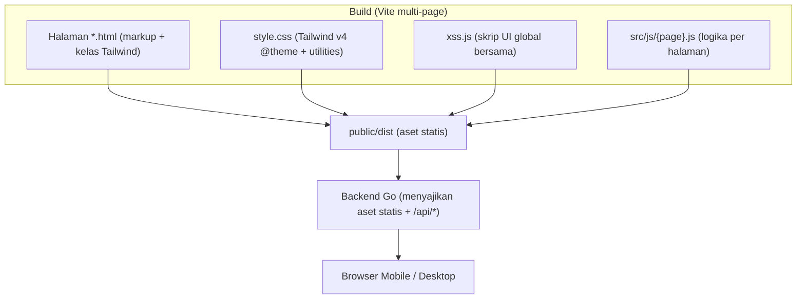
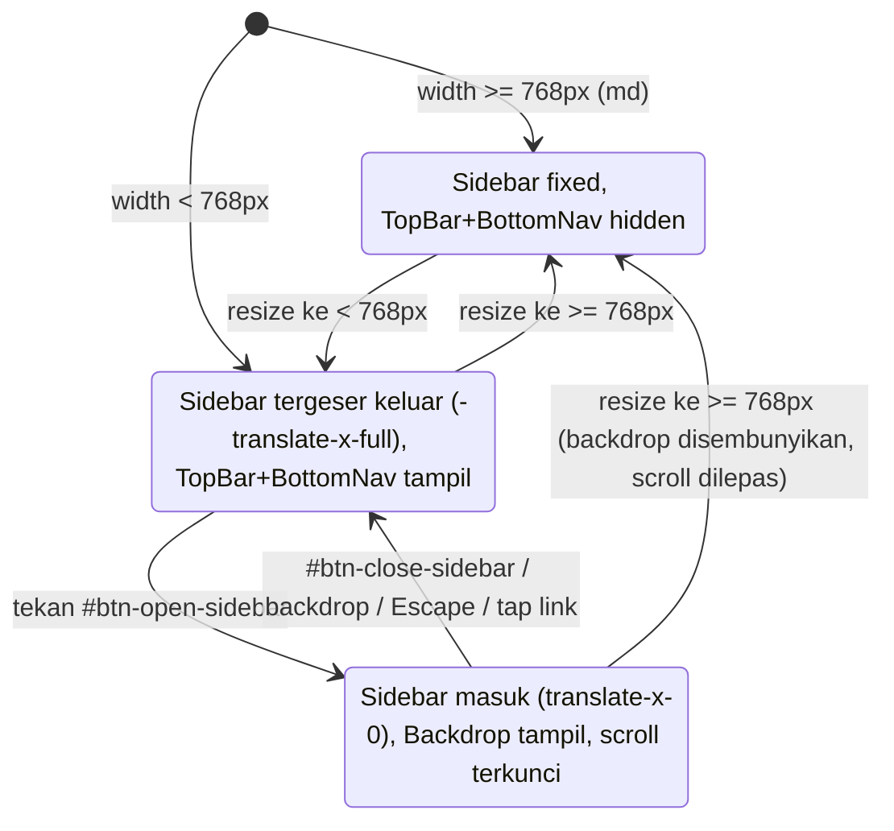

# Design Document

## Overview

Dokumen ini merancang standardisasi tampilan mobile aplikasi web **Mubtadiaat**. Fokusnya adalah lapisan tampilan (markup HTML, kelas Tailwind CSS, dan skrip UI vanilla yang sudah ada seperti `xss.js`) tanpa mengubah logika bisnis backend Go, skema data, maupun aturan RBAC.

Inti masalah saat ini adalah **inkonsistensi antar halaman**. Berdasarkan penelaahan kode:

- **`index.html` + `xss.js` adalah implementasi acuan (gold standard)** yang sudah benar: memiliki `aside#app-sidebar` sebagai drawer berbasis transform (`-translate-x-full md:translate-x-0`), tombol `#btn-close-sidebar`, `#sidebar-backdrop`, Top Bar Mobile dengan `#btn-open-sidebar` dan `#theme-toggle-mobile`, serta Bottom Nav dengan Floating Action Button (FAB), memakai ikon Lucide.
- **`rekap.html` mewakili halaman "warisan" yang rusak**: elemen `aside` **tidak** memiliki `id="app-sidebar"` dan memakai `hidden md:flex` (bukan drawer transform), sehingga handler drawer global di `xss.js` (`getElementById('app-sidebar')`) gagal menemukannya dan drawer tidak berfungsi. Halaman ini juga tidak punya `#btn-close-sidebar`, tidak punya Bottom Nav, tombol tema tanpa `id`/`aria-label`, dan memakai SVG inline (bukan Lucide).

Selain itu ditemukan beberapa inkonsistensi lintas halaman yang menjadi target perbaikan:

1. **Meta viewport** pada `index.html`, `rekap.html`, dan halaman lain menetapkan `maximum-scale=1.0, user-scalable=no` — melanggar Requirement 12 (zoom harus aktif).
2. **Daftar `menuAccess`** untuk peran `wali_santri` berbeda antar sumber: `xss.js` dan head-guard `index.html` memakai `['/index.html', '/rapot.html']`, sedangkan head-guard `rekap.html` memakai `['/index.html', '/absensi.html', '/rapot.html']` (Requirement 4.3).
3. **`main.js` memuat handler sidebar lama** yang menyeleksi `aside` generik + `#sidebar-overlay` dengan mekanisme `hidden`, konflik dengan drawer `#app-sidebar` milik `xss.js`.
4. **`pb-safe` / safe-area** dipakai di markup tetapi belum tentu terdefinisi sebagai utility dan belum didukung `viewport-fit=cover`.

Strategi desain: menetapkan **satu pola markup navigasi kanonik** (disalin dari `index.html`), **satu sumber kebenaran RBAC** (di `xss.js`), dan **satu perilaku JS drawer/bottom-nav global** (di `xss.js`), lalu menerapkannya ke seluruh halaman tercakup, dengan prioritas pada `index.html`, `absensi.html`, `rapot.html`, `rekap.html`, dan `profil-santri.html`.

### Sasaran Desain

- Konsistensi struktur navigasi (Drawer_Sidebar, Top_Bar_Mobile, Bottom_Nav) di seluruh halaman kecuali `login.html` dan `change-password.html`.
- Perilaku drawer, bottom nav, RBAC, dan aksesibilitas yang seragam melalui skrip global bersama.
- Keterbacaan tabel lebar, target sentuh yang memadai, form/modal/hero responsif.
- Breakpoint Tailwind bawaan yang konsisten dengan `md` (768px) sebagai batas mobile/desktop.

### Non-Sasaran

- Tidak mengubah endpoint/handler Go, skema database, atau aturan otorisasi server-side.
- Tidak mengubah alur fungsional fitur (mis. logika perhitungan rekap/nilai) di luar penyajian tampilan.
- Tidak menambah framework baru; tetap Vite + Tailwind CSS v4 + JS vanilla.

## Architecture

### Lapisan Sistem_Tampilan



Tanggung jawab tiap lapisan:

- **Markup HTML per halaman**: memuat blok navigasi kanonik (sidebar, backdrop, top bar, bottom nav) dengan struktur, `id`, ikon, dan kelas Tailwind yang identik.
- **`style.css` (Tailwind v4)**: mendefinisikan token tema (`@theme`), utility kustom (`glass`, `glass-input`, `text-gradient`), guard `role-ready`, dan utility baru `pb-safe` untuk safe-area.
- **`xss.js` (global)**: satu-satunya sumber perilaku navigasi lintas halaman — drawer open/close, scroll-lock, escape/backdrop/link-close, reset saat resize, `applyRoleUI` (RBAC), penandaan tautan aktif Bottom_Nav, logout, dan theme toggle mobile.
- **`src/js/{page}.js`**: hanya logika spesifik halaman (fetch data, render tabel/kartu), tidak lagi menangani drawer sidebar (handler lama di `main.js` dihapus).

### Prinsip Arsitektur

1. **Single Source of Truth untuk RBAC**: peta `menuAccess` hanya didefinisikan di `xss.js`. Head-guard sinkron di tiap halaman tetap ada untuk mencegah "flash" menu terlarang, tetapi harus memakai daftar yang identik dengan `xss.js`.
2. **Progressive enhancement**: markup navigasi berfungsi secara struktural tanpa JS; JS menambah interaksi (drawer, active-state). CSS `role-ready` menjaga nav tersembunyi sampai RBAC selesai (Requirement 4.4).
3. **Mobile-first + breakpoint tunggal**: seluruh aturan responsif memakai breakpoint Tailwind bawaan; `md` (768px) adalah satu-satunya batas peralihan Viewport_Mobile ↔ Viewport_Desktop (Requirement 10).
4. **Perilaku terpusat, markup diduplikasi terkontrol**: karena tidak ada template server-side untuk HTML statis, markup navigasi diduplikasi antar halaman namun WAJIB identik. Konsistensi dijaga lewat checklist dan pengujian struktural.

### Peralihan Viewport (state)



## Components and Interfaces

### 1. Drawer_Sidebar (`aside#app-sidebar`)

Pola kanonik (dari `index.html`):

```html
<aside id="app-sidebar"
  class="flex flex-col w-64 fixed inset-y-0 left-0 bg-white dark:bg-slate-800
         border-r border-gray-100 dark:border-slate-700/60 z-[70]
         transition-transform duration-300 transform -translate-x-full md:translate-x-0
         shadow-[4px_0_24px_rgba(0,0,0,0.02)] print:hidden">
  <button id="btn-close-sidebar" class="md:hidden absolute top-4 right-4 p-2 ..." aria-label="Tutup menu">
    <i data-lucide="x" class="w-5 h-5"></i>
  </button>
  <nav class="flex-1 overflow-y-auto p-4 flex flex-col gap-1 custom-scrollbar"> ... </nav>
</aside>
<div id="sidebar-backdrop" class="hidden md:hidden fixed inset-0 bg-gray-900/50 dark:bg-black/60 backdrop-blur-sm z-[65]"></div>
```

- **Desktop**: `md:translate-x-0` membuat sidebar tetap (fixed) terlihat; Top Bar & Bottom Nav disembunyikan via `md:hidden`.
- **Mobile**: default `-translate-x-full` (tergeser keluar); dibuka dengan menghapus kelas tersebut.
- **Interface JS** (di `xss.js`, sudah ada dan menjadi acuan): `openSidebar()`, `closeSidebar()` yang men-toggle `-translate-x-full` pada `#app-sidebar`, menampilkan/menyembunyikan `#sidebar-backdrop`, dan mengunci scroll body via `overflow-hidden md:overflow-auto`.

### 2. Top_Bar_Mobile (`header.md:hidden`)

```html
<header class="md:hidden h-16 ... flex items-center justify-between px-4 sticky top-0 z-40">
  <button id="btn-open-sidebar" class="p-2 -ml-2 rounded-full ..." aria-label="Buka menu"> <i data-lucide="menu"></i> </button>
  <h1 class="text-lg font-bold ...">Mubtadiaat</h1>
  <button id="theme-toggle-mobile" class="p-2 -mr-2 rounded-full ..." aria-label="Ganti tema"> <i data-lucide="moon"></i> </button>
</header>
```

Hanya tampil pada Viewport_Mobile (`md:hidden`), disematkan di atas (`sticky top-0`).

### 3. Bottom_Nav + Tombol_Aksi_Mengambang (FAB)

```html
<nav class="md:hidden fixed bottom-0 left-0 right-0 ... z-50 px-6 py-2 pb-safe ...">
  <div class="flex justify-between items-center relative h-14">
    <a href="/index.html" data-nav class="flex flex-col items-center gap-1.5 ..."> <i data-lucide="home"></i> <span class="text-[10px]">Beranda</span> </a>
    <a href="/santri.html" data-nav class="... mr-8"> ... </a>
    <div class="absolute left-1/2 -translate-x-1/2 -top-6">
      <button id="btn-mobile-search" class="w-14 h-14 ... rounded-full ..." aria-label="Cari"> <i data-lucide="search"></i> </button>
    </div>
    <a href="/penilaian.html" data-nav class="... ml-8"> ... </a>
    <a href="/absensi.html" data-nav class="..."> ... </a>
  </div>
</nav>
```

- `fixed bottom-0` memastikan tetap menempel saat konten digulir (Requirement 3.1).
- FAB di tengah (`absolute left-1/2 -translate-x-1/2 -top-6`) untuk aksi utama (pencarian global), memicu `openSearchModal()` di `main.js` (Requirement 3.2).
- **Penandaan tautan aktif** (Requirement 3.3): fungsi baru di `xss.js`, `markActiveNav()`, membandingkan `window.location.pathname` dengan `href` tiap `a[data-nav]`, lalu menambahkan kelas aktif (`text-indigo-600 dark:text-indigo-400`) pada tautan yang cocok dan kelas non-aktif pada lainnya.
- Konten utama memberi `pb-24 md:pb-8` agar tidak tertutup Bottom Nav (Requirement 3.4).
- Utility `pb-safe` menambah `padding-bottom: env(safe-area-inset-bottom)` untuk safe-area (Requirement 3.5).

### 4. Modul RBAC Navigasi (`applyRoleUI` di `xss.js`)

Interface:

```js
// Sumber kebenaran tunggal — dipakai semua halaman
const MENU_ACCESS = { pimpinan: [...], admin: [...], mufatish: [...], mustahiq: [...], munawwib: [...], wali_santri: [...] };

// Fungsi murni: menghitung tautan yang boleh ditampilkan untuk sebuah peran
function computeAllowedLinks(role) { return MENU_ACCESS[role] || []; }

// Efek DOM: menyembunyikan tautan tak-diizinkan di sidebar & bottom nav, lalu menandai nav 'role-ready'
window.applyRoleUI = function(role) { ... }
```

- `applyRoleUI` menyembunyikan `aside nav a` dan `nav.md\:hidden a` yang `href`-nya tidak ada dalam `computeAllowedLinks(role)` (Requirement 4.1, 4.2), lalu menambah kelas `role-ready` untuk menampilkan nav (Requirement 4.4).
- Head-guard sinkron per halaman WAJIB memakai peta yang identik untuk mencegah flash sebelum `xss.js` dieksekusi (Requirement 4.3). Untuk menghilangkan duplikasi yang rawan divergen, desain menyalin blok `menuAccess` yang sama persis ke setiap head-guard, dengan `xss.js` sebagai acuan pembanding saat pengujian.

### 5. Komponen_Tabel_Lebar

Dua pola tergantung jenis data:

- **Wadah gulir horizontal** (`overflow-x-auto`) untuk tabel yang tetap disajikan sebagai tabel (mis. leger nilai): tabel dapat digulir horizontal di dalam wadahnya tanpa menggulir seluruh halaman (Requirement 5.1). Kolom pengenal baris (mis. nama santri) dibuat "lengket" dengan `sticky left-0` + latar solid agar tetap terlihat (Requirement 5.2). Indikator gulir (bayangan tepi/`fade`) ditampilkan saat ada konten di luar layar (Requirement 5.4). Ukuran teks minimal `text-xs` (12px) (Requirement 5.5).
- **Kartu per santri** untuk rekap absensi siswa pada Viewport_Mobile: data dirender sebagai kartu (`#rekap-siswa-view`) alih-alih tabel lebar sehingga terbaca tanpa gulir horizontal (Requirement 5.3). Tabel penuh tetap tersedia pada Viewport_Desktop.

Pola indikator gulir (contoh):

```html
<div class="relative">
  <div class="overflow-x-auto scroll-shadow"> <table class="min-w-max text-xs md:text-sm"> ... </table> </div>
</div>
```

### 6. Komponen_Form dan Filter

- Pada Viewport_Mobile, form/filter memakai `flex flex-col` (satu kolom) dan `sm:flex-row` untuk layar lebih besar (Requirement 7.1).
- Input/select/tombol utama memakai `w-full` pada mobile dan lebar tetap (`sm:w-48`) pada breakpoint `sm` ke atas (Requirement 7.2).
- Input fokus dijaga terlihat di atas keyboard virtual dengan `scroll-margin` + memanggil `scrollIntoView({ block: 'center' })` pada event `focus` (Requirement 7.3).
- Tipe input sesuai semantik (`type="date"`, dll.) agar kontrol native tampil (Requirement 7.4) — sudah dipakai di `rekap.html`.
- Kontrol tab/filter pada halaman prioritas dibungkus wadah `overflow-x-auto` agar tetap dapat diakses dan digulir tanpa meluap (Requirement 11.3).

### 7. Komponen_Modal (`#search-modal`, modal tambah/edit)

- Kontainer modal `w-full max-w-2xl` dengan padding luar `p-4 sm:p-6 md:p-12` sehingga menyesuaikan Viewport_Mobile tanpa keluar layar (Requirement 8.1).
- Tinggi `h-[80vh] md:h-[600px]` dengan area isi `overflow-y-auto` untuk gulir vertikal saat konten melebihi layar (Requirement 8.2).
- Tombol tutup memenuhi ukuran Target_Sentuh (Requirement 8.3 → Requirement 6).
- Saat modal terbuka pada mobile, scroll latar dicegah dengan mengunci `overflow-hidden` pada body (Requirement 8.4).

### 8. Header_Hero

- `flex flex-col md:flex-row` untuk tata letak vertikal pada mobile (Requirement 9.1).
- Skala teks judul responsif `text-3xl md:text-4xl` (Requirement 9.2).
- Konten dijaga dalam batas lebar dengan padding wadah (`px-4 md:px-8`) dan `break-words` bila perlu (Requirement 9.3).

### 9. Target_Sentuh & Aksesibilitas

- Utility `.tap-target` (baru) menjamin area minimal 44×44px pada Viewport_Mobile (Requirement 6.1) dan diterapkan pada tombol ikon/tautan aksi.
- Jarak antar target berdekatan minimal 8px via `gap-2`/`space-*` (Requirement 6.2).
- Semua ikon-only interaktif memakai `aria-label` (Requirement 6.3).
- Meta viewport diseragamkan menjadi `width=device-width, initial-scale=1.0, viewport-fit=cover` — tanpa `maximum-scale`/`user-scalable=no` agar zoom aktif (Requirement 12.1–12.3).

### 10. Konsistensi Breakpoint

Seluruh aturan responsif memakai breakpoint Tailwind bawaan (`sm` 640, `md` 768, `lg` 1024, `xl` 1280). `md` adalah batas mobile/desktop. Nilai breakpoint kustom di luar bawaan Tailwind dilarang (Requirement 10.1–10.3).

## Data Models

Model data fitur ini bersifat konfigurasi tampilan (bukan skema persist backend).

### NavItem

```
NavItem {
  href: string        // mis. "/absensi.html"
  label: string       // mis. "Absensi"
  icon: string        // nama ikon Lucide, mis. "clipboard-list"
  section?: string    // grup di sidebar: "Utama" | "Akademik" | "Database & Arsip" | "Lainnya"
  inBottomNav: bool    // apakah tampil di Bottom_Nav
}
```

### MenuAccess (RBAC — sumber tunggal di `xss.js`)

```
MenuAccess: Map<Peran, string[]>   // Peran -> daftar href yang diizinkan

Peran = "pimpinan" | "admin" | "mufatish" | "mustahiq" | "munawwib" | "wali_santri"
```

Nilai kanonik (mengacu `xss.js`, harus identik di seluruh head-guard):

```
pimpinan / admin : semua halaman (termasuk /settings.html)
mufatish         : semua kecuali /settings.html
mustahiq         : /index, /penilaian, /absensi, /rapot, /laporan, /rekap
munawwib         : /index, /absensi
wali_santri      : /index, /rapot
```

> Catatan: divergensi `wali_santri` pada head-guard `rekap.html` (yang menyertakan `/absensi.html`) akan diselaraskan ke daftar kanonik ini.

### ViewportState (turunan, bukan tersimpan)

```
ViewportState = "mobile" | "desktop"     // mobile: width < 768px; desktop: width >= 768px
DrawerState   = "closed" | "open"        // hanya relevan pada mobile
```

### NavActiveState

```
resolveActiveNav(pathname: string, items: NavItem[]) -> NavItem | null
// Mengembalikan item yang href-nya cocok dengan pathname halaman aktif (untuk penandaan Bottom_Nav)
```

## Correctness Properties

*Sebuah properti adalah karakteristik atau perilaku yang harus selalu benar di seluruh eksekusi valid sistem — pada dasarnya pernyataan formal tentang apa yang seharusnya dilakukan sistem. Properti menjembatani spesifikasi yang terbaca manusia dengan jaminan kebenaran yang dapat diverifikasi mesin.*

Sebagian besar fitur ini adalah tata letak dan struktur DOM (diverifikasi melalui pengujian struktural, interaksi, snapshot visual, dan pemindaian markup statis — lihat Testing Strategy). Namun terdapat **lapisan logika murni** yang benar-benar bervariasi terhadap input dan layak diuji dengan property-based testing: (a) penyaringan menu berbasis peran (RBAC), (b) konsistensi peta izin menu antar halaman, dan (c) penentuan tautan navigasi aktif. Properti berikut hanya mencakup lapisan tersebut.

### Property 1: Tautan navigasi yang terlihat sama dengan irisan tautan yang tersedia dan yang diizinkan peran

*Untuk setiap* Peran yang valid dan *untuk setiap* himpunan tautan navigasi yang ada pada halaman (baik di Drawer_Sidebar maupun Bottom_Nav), setelah `applyRoleUI(role)` dijalankan, himpunan tautan yang terlihat harus sama persis dengan irisan antara tautan yang ada di halaman dan `computeAllowedLinks(role)` — tidak ada tautan terlarang yang terlihat, dan tidak ada tautan yang diizinkan lagi tersedia yang tersembunyi.

**Validates: Requirements 4.1, 4.2**

### Property 2: Peta izin menu konsisten antar halaman

*Untuk setiap* halaman aplikasi yang tercakup dan *untuk setiap* Peran, daftar `menuAccess[Peran]` yang tertanam pada head-guard sinkron halaman tersebut harus sama (set-equal) dengan `MENU_ACCESS[Peran]` kanonik di `xss.js`.

**Validates: Requirements 4.3**

### Property 3: Penentuan tautan aktif benar dan tunggal

*Untuk setiap* `pathname` halaman, `resolveActiveNav(pathname, items)` harus menandai tepat satu tautan sebagai aktif jika `pathname` cocok dengan `href` salah satu item, dan tidak menandai satu pun bila tidak ada yang cocok; tautan lain selain yang cocok tidak boleh ditandai aktif.

**Validates: Requirements 3.3**

## Error Handling

- **Peran tidak dikenal / kosong**: `computeAllowedLinks(role)` mengembalikan array kosong (`MENU_ACCESS[role] || []`), sehingga tidak ada tautan yang ditampilkan alih-alih membocorkan menu terlarang. `applyRoleUI` tetap menambah `role-ready` agar UI tidak macet tersembunyi.
- **`/api/me` gagal atau tidak terautentikasi**: perilaku existing dipertahankan — `main.js` mengalihkan ke `/login.html`; `xss.js` memakai `localStorage.user_role` sebagai fallback untuk mencegah flash, dan tetap memanggil `applyRoleUI` saat `DOMContentLoaded` bila peran tersimpan.
- **Elemen navigasi tidak ada** (mis. halaman `login.html`): handler drawer global melakukan guard `if (!sidebar) return;` sehingga tidak ada error saat elemen tidak ada.
- **`localStorage` tidak tersedia / melempar** (mode privasi): head-guard dibungkus `try/catch` (sudah ada) sehingga kegagalan tidak memblokir render halaman.
- **Ikon Lucide gagal dimuat** (jaringan): ikon tidak tampil namun `aria-label` pada elemen memastikan makna aksi tetap dapat diakses; tata letak tidak rusak karena ukuran kontrol ditentukan kelas Tailwind, bukan ikon.
- **`resolveActiveNav` tanpa kecocokan**: mengembalikan `null` dan tidak menandai tautan mana pun (tidak melempar).
- **Safe-area tidak didukung perangkat**: `env(safe-area-inset-bottom)` bernilai `0`, sehingga `pb-safe` menurun dengan aman ke padding dasar tanpa efek samping.

## Testing Strategy

### Pendekatan Ganda

- **Property-based tests**: hanya untuk lapisan logika murni (RBAC filtering, konsistensi peta menu, active-nav) sesuai Correctness Properties.
- **Unit / structural / interaction tests**: untuk struktur DOM, perilaku drawer/modal, dan atribut statis.
- **Visual/snapshot tests**: untuk tata letak responsif (hero, tabel lengket, spacing) yang tidak cocok untuk assertion logika.

### Penerapan Property-Based Testing

- Library: **fast-check** (ekosistem JS/Vitest) — TIDAK mengimplementasikan PBT dari nol.
- Runner: **Vitest** dengan lingkungan **jsdom** untuk memuat markup navigasi kanonik dan menjalankan `applyRoleUI` / `resolveActiveNav`.
- Setiap properti diimplementasikan sebagai **satu** property test, minimal **100 iterasi**.
- Generator:
  - **Peran**: `fc.constantFrom('pimpinan','admin','mufatish','mustahiq','munawwib','wali_santri')` ditambah string acak untuk menguji peran tak dikenal (edge case Error Handling).
  - **Himpunan tautan halaman**: subset acak dari daftar seluruh href untuk mensimulasikan variasi tautan yang ada.
  - **pathname**: dipilih acak dari href item nav dan dari path yang tidak cocok.
- Format tag komentar tiap property test: `// Feature: mobile-responsive-ui, Property {number}: {property_text}`.
  - Property 1 → uji kesetaraan himpunan tautan terlihat vs irisan(tersedia, allowed(role)).
  - Property 2 → parse `menuAccess` yang tertanam pada tiap file halaman, bandingkan set-equal dengan peta kanonik untuk tiap peran.
  - Property 3 → uji `resolveActiveNav` menandai tepat satu / nol tautan.

### Unit & Structural Tests (contoh & edge case)

- **Struktur navigasi per halaman** (Req 1.1–1.4, 11.2): untuk tiap halaman kecuali `login`/`change-password`, assert keberadaan `aside#app-sidebar`, `#btn-close-sidebar`, `#sidebar-backdrop`, `header` dengan `#btn-open-sidebar`, dan `nav.md:hidden` bottom nav; assert blok nav ter-normalisasi identik dengan acuan `index.html`.
- **Perilaku drawer** (Req 2.1–2.7): interaksi jsdom/Playwright untuk open/close via hamburger, tombol tutup, backdrop, Escape, tap link (mobile), scroll-lock body, dan reset saat resize melewati 768px.
- **Bottom nav & FAB** (Req 3.1–3.2, 3.4): assert `fixed bottom-0`, satu FAB `#btn-mobile-search` di tengah, dan `pb-24` pada `main`.
- **Modal** (Req 8.1–8.4): buka `#search-modal` pada lebar mobile, assert kotak batas di dalam viewport, area isi `overflow-y-auto`, tombol tutup memenuhi ukuran, dan scroll-lock body.
- **Guard RBAC** (Req 4.4): assert nav tanpa `role-ready` (opacity 0) sebelum `applyRoleUI`, dan ber-`role-ready` sesudahnya.
- **Aksesibilitas** (Req 6.3): untuk tiap halaman, assert setiap tombol/tautan ikon-only memiliki `aria-label` tak kosong.

### Static Markup Scans (lint-style)

- **Meta viewport** (Req 12.1–12.3): untuk tiap halaman, assert `content` memuat `initial-scale=1.0`, tidak memuat `user-scalable=no`, dan tidak membatasi zoom via `maximum-scale`.
- **Breakpoint** (Req 10.1–10.3): pindai kelas responsif; pastikan prefiks hanya `sm|md|lg|xl` dan peralihan mobile/desktop konsisten memakai `md:`; tidak ada media query breakpoint kustom untuk tata letak.

### Visual / Snapshot Tests

- **Tabel lebar** (Req 5.1–5.5): snapshot pada lebar mobile untuk memastikan wadah `overflow-x-auto`, kolom pengenal `sticky left-0`, indikator gulir tampil saat `scrollWidth > clientWidth`, teks ≥ 12px, dan kartu per-santri untuk rekap absensi siswa.
- **Form/hero/tab** (Req 7.1–7.2, 9.1–9.3, 11.3): snapshot pada breakpoint mobile untuk tata letak kolom tunggal, kontrol `w-full`, skala teks hero, dan baris tab/filter yang dapat digulir tanpa meluap.
- **Target sentuh** (Req 6.1–6.2): pengukuran `boundingBox` Playwright memastikan ≥ 44×44px dan jarak ≥ 8px pada Viewport_Mobile.

### Cakupan Halaman Prioritas (Req 11.1)

Rangkaian pengujian struktural, interaksi, dan visual dijalankan penuh terhadap lima halaman prioritas: `index.html`, `absensi.html`, `rapot.html`, `rekap.html`, dan `profil-santri.html`, kemudian diperluas ke halaman tercakup lainnya.
