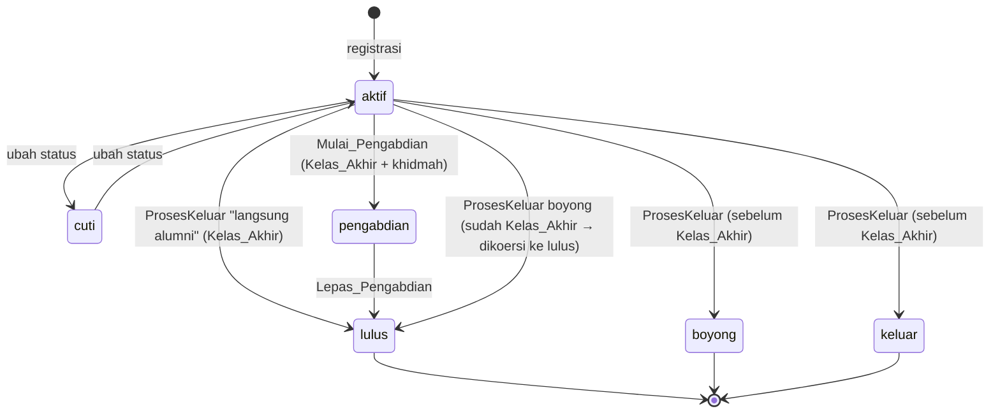
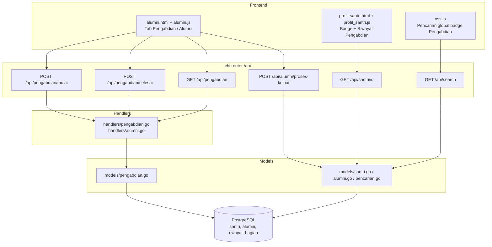

# Design Document

## Overview

Fitur **Pengabdian (Khidmah)** menambahkan satu tahap antara pada siklus hidup santri: dari `aktif` → `pengabdian` → `lulus` (alumni). Pengabdian bersifat sukarela bagi lulusan **Kelas 3 Aliyah** (Kelas_Akhir); mereka boleh langsung menjadi alumni (`lulus`) atau berkhidmah dulu (`pengabdian`) baru kemudian diresmikan menjadi alumni.

Desain ini mengikuti pola arsitektur yang sudah ada pada aplikasi "Mubtadiat Manajemen Sistem":

- **Backend Go** (chi + pgx/PostgreSQL): perubahan skema lewat file migrasi baru, penambahan fungsi model yang transaksional (mengikuti gaya `ProsesKeluarSantri`), handler tipis yang men-decode JSON dan memanggil model, serta RBAC lewat middleware `RequireRoles`.
- **Frontend statis** (HTML + Tailwind + JS vanilla, Vite): penambahan tab pada `alumni.html`/`alumni.js`, penanda status & riwayat pengabdian pada `profil-santri.html`/`profil_santri.js`, dan badge "Pengabdian" pada pencarian global (`xss.js`).

Prinsip utama desain:

1. **Satu tempat khidmah aktif per santri** — data khidmah disimpan langsung sebagai kolom pada tabel `santri` (bukan tabel riwayat terpisah), sesuai non-tujuan pada requirements.
2. **Alumni terbentuk hanya saat lulus** — baris `alumni` hanya dibuat pada transisi ke `lulus` (baik langsung dari `aktif` maupun dari `pengabdian`), memakai `ON CONFLICT DO NOTHING` agar idempoten.
3. **Konsistensi transaksi** — semua transisi status memakai `tx` (begin/commit/rollback) seperti model existing.
4. **Reuse logika "Kelas 3 Aliyah"** — deteksi Kelas_Akhir menyalin aturan yang sudah dipakai frontend `perpindahan.js` (`isKelasAkhirAliyah`) agar backend & frontend sepakat.

### Ringkasan Temuan dari Kode Existing

Hasil penelusuran kode yang menjadi dasar desain:

- `migrations/002_master.sql`: `santri.status VARCHAR(50) NOT NULL CHECK (status IN ('aktif','cuti','boyong','lulus','keluar'))`. Constraint hanya didefinisikan di sini; tidak ada migrasi lanjutan yang mengubahnya. Migrasi baru harus **DROP lalu ADD** constraint untuk menambah `pengabdian`.
- `migrations/006_alumni.sql`: tabel `alumni (santri_id UNIQUE, tahun_lulus, status_khidmah, status_ijazah, extra, ...)`. Kolom `alumni.khidmah` dan `alumni.no_ijazah` **tidak** ada di migrasi ini — keduanya ditambahkan lewat skrip `scripts/fix_alumni/fix_alumni.go` (`status_khidmah` di-rename menjadi `khidmah`, dan `no_ijazah` ditambahkan). Migrasi baru akan memakai `ADD COLUMN IF NOT EXISTS` untuk `khidmah` agar aman di lingkungan yang belum menjalankan skrip tersebut.
- `models/santri.go`: kolom santri dikumpulkan pada konstanta `santriSelectCols` dan dipindai oleh `scanSantriFull`. Menambah kolom khidmah cukup di dua tempat ini agar konsisten pada `GetSantriAktif`, `GetSantriByBagian`, `GetArsipSantri`, dan `GetSantriByID`. `GetSantriAktif` sudah memfilter `WHERE s.status = 'aktif'` — santri pengabdian otomatis tidak ikut (memenuhi Requirement 10).
- `models/alumni.go`: `ProsesKeluarSantri` memakai transaksi (update `santri`, tutup `riwayat_bagian`, insert `proses_keluar`, insert `alumni ON CONFLICT DO NOTHING`). Ini menjadi template untuk fungsi transisi baru.
- `models/perpindahan.go`: `UbahStatusStatusSantri` mengubah status dan menutup `riwayat_bagian` jika status bukan `aktif`.
- `models/pencarian.go`: `GlobalSearch` query 1 memfilter `s.status = 'aktif'`; tipe hasil ditentukan hard-coded (`"santri"`, `"alumni"`, `"pengajar"`). `DataUtamaSantri` sudah memuat field `Status`.
- `main.go`: grup rute `/api/alumni` (tulis: `pimpinan,admin`; baca `GET /`: `pimpinan,admin,mufatish`), `/api/perpindahan` (tulis: `pimpinan,admin`), `/api/santri` (baca detail terbuka untuk staf). RBAC lewat `appMiddleware.RequireRoles(...)`.
- Frontend `perpindahan.js`: `isKelasAkhirAliyah()` = tingkatan cocok `/aliyah/i` **dan** nama kelas cocok `/(^|\D)3(\D|$)/` atau `/tiga/i`. `alumni.js`: memakai `window.isAdminRole(role)` untuk gating tombol tulis; tabel dirender oleh `renderTable`. `profil_santri.js`: `statusMap` memetakan status→label/kelas warna badge. `xss.js`: render hasil pencarian bercabang pada `item.tipe`.
- Tooling test: backend Go `testing` standar (`models/*_test.go`, butuh DB Postgres test). Frontend Vitest + fast-check + jsdom (`frontend/tests/*.property.test.js`).

## Architecture

### Alur transisi status santri



Efek samping tiap transisi:

| Transisi | status | bagian_id | riwayat_bagian | khidmah_tempat | khidmah_mulai | khidmah_selesai | baris alumni |
|---|---|---|---|---|---|---|---|
| Mulai_Pengabdian | `pengabdian` | → NULL | tutup yang terbuka | diisi | diisi | — | tidak dibuat |
| Lepas_Pengabdian | `lulus` | tetap NULL | (sudah tertutup) | tetap | tetap | diisi | dibuat (ON CONFLICT DO NOTHING), salin khidmah_tempat → alumni.khidmah |
| ProsesKeluar lulus | `lulus` | → NULL | tutup yang terbuka | — | — | — | dibuat |
| ProsesKeluar boyong/keluar | `boyong`/`keluar` | → NULL | tutup yang terbuka | — | — | — | dibuat (arsip) |

### Lapisan komponen



## Components and Interfaces

### 1. Migrasi database (baru)

**File:** `migrations/020_pengabdian_khidmah.sql` (mengikuti pola penomoran; tidak mengubah migrasi lama).

Isi:

```sql
-- 020_pengabdian_khidmah.sql
-- Menambah tahap "Pengabdian" (Khidmah) pada siklus hidup santri.

-- 1. Perluas CHECK constraint santri.status agar menerima 'pengabdian'.
--    Constraint asli dibuat inline di 002_master.sql tanpa nama eksplisit,
--    sehingga PostgreSQL memberinya nama otomatis santri_status_check.
ALTER TABLE santri DROP CONSTRAINT IF EXISTS santri_status_check;
ALTER TABLE santri ADD CONSTRAINT santri_status_check
    CHECK (status IN ('aktif', 'cuti', 'pengabdian', 'lulus', 'boyong', 'keluar'));

-- 2. Kolom khidmah pada santri (semua nullable → boleh kosong untuk santri
--    yang belum pernah berkhidmah).
ALTER TABLE santri ADD COLUMN IF NOT EXISTS khidmah_tempat   TEXT;
ALTER TABLE santri ADD COLUMN IF NOT EXISTS khidmah_mulai    DATE;
ALTER TABLE santri ADD COLUMN IF NOT EXISTS khidmah_selesai  DATE;

-- 3. Pastikan kolom alumni.khidmah tersedia (dibuat lewat skrip fix_alumni
--    pada sebagian lingkungan; idempoten di sini agar migrasi mandiri).
ALTER TABLE alumni ADD COLUMN IF NOT EXISTS khidmah VARCHAR(255);

-- 4. Indeks bantu untuk daftar & filter santri pengabdian.
CREATE INDEX IF NOT EXISTS idx_santri_status ON santri(status);
```

Catatan: nama constraint otomatis untuk CHECK inline pada PostgreSQL adalah `<tabel>_<kolom>_check` → `santri_status_check`. `DROP CONSTRAINT IF EXISTS` membuat migrasi aman dijalankan ulang.

### 2. Deteksi Kelas_Akhir ("sudah menuntaskan Kelas 3 Aliyah")

Kelas_Akhir ditentukan dari **tingkatan & kelas terakhir** yang pernah/masih ditempati santri, yang direkam pada `riwayat_bagian → bagian → (tingkatan, kelas)`.

Kaidah pengenalan (menyalin logika frontend `isKelasAkhirAliyah`):

- **tingkatan** dianggap Aliyah bila `tingkatan.nama` cocok regex case-insensitive `aliyah`.
- **kelas** dianggap tingkat 3 bila `kelas.nama` mengandung angka 3 sebagai token (`(^|\D)3(\D|$)`) **atau** kata `tiga`.
- Santri berada di Kelas_Akhir bila kedua syarat terpenuhi.

Fungsi murni di Go (mudah diuji unit/property):

```go
// models/pengabdian.go
// IsKelasAkhir mengembalikan true bila kombinasi nama tingkatan & nama kelas
// menandakan "Kelas 3 Aliyah". Aturan disamakan dengan frontend perpindahan.js.
func IsKelasAkhir(tingkatanNama, kelasNama string) bool
```

Sumber data untuk fungsi ini diambil dari **riwayat kelas terakhir** santri (baris `riwayat_bagian` dengan `tanggal_mulai` terbaru), sama seperti kolom `tingkatan_akhir` pada `GetAllAlumni`:

```sql
SELECT t.nama, k.nama
FROM riwayat_bagian rb
JOIN bagian b ON rb.bagian_id = b.id
LEFT JOIN tingkatan t ON b.tingkatan_id = t.id
LEFT JOIN kelas k ON b.kelas_id = k.id
WHERE rb.santri_id = $1
ORDER BY rb.tanggal_mulai DESC NULLS LAST, rb.id DESC
LIMIT 1;
```

Helper model:

```go
// GetKelasAkhirStatus mengambil tingkatan & kelas terakhir santri lalu
// mengembalikan hasil IsKelasAkhir. Dipakai oleh ProsesKeluar untuk koersi
// boyong → lulus. Bila santri tidak punya riwayat, mengembalikan false.
func GetKelasAkhirStatus(ctx context.Context, tx pgx.Tx, santriID int) (bool, error)
```

Deteksi ini menentukan percabangan:

- **Kelas_Akhir + memilih khidmah** → `Mulai_Pengabdian` (Requirement 4.2).
- **Kelas_Akhir + langsung alumni / boyong** → `lulus` + baris alumni (Requirement 4.1, 4.3).
- **Belum Kelas_Akhir + boyong/keluar** → tetap `boyong`/`keluar`, masuk arsip, bukan alumni lulus (Requirement 4.4–4.6).

### 3. Model baru — `models/pengabdian.go`

```go
package models

type MulaiPengabdianInput struct {
    SantriID      int    `json:"santri_id"`
    KhidmahTempat string `json:"khidmah_tempat"`
    KhidmahMulai  string `json:"khidmah_mulai"` // "YYYY-MM-DD"
}

type SelesaiPengabdianInput struct {
    SantriID       int    `json:"santri_id"`
    KhidmahSelesai string `json:"khidmah_selesai"` // "YYYY-MM-DD"
}

type PengabdianItem struct {
    SantriID      int     `json:"santri_id"`
    Nama          string  `json:"nama"`
    NomorStambuk  string  `json:"nomor_stambuk"`
    KhidmahTempat *string `json:"khidmah_tempat"`
    KhidmahMulai  *string `json:"khidmah_mulai"`
}

// Validasi input murni (tanpa DB) supaya bisa diuji lepas dari koneksi.
func ValidateMulaiPengabdian(in MulaiPengabdianInput) error
func ValidateSelesaiPengabdian(in SelesaiPengabdianInput) error

// Transisi aktif → pengabdian (transaksional).
func MulaiPengabdian(ctx context.Context, in MulaiPengabdianInput) error

// Transisi pengabdian → lulus (transaksional), membuat baris alumni.
func SelesaiPengabdian(ctx context.Context, in SelesaiPengabdianInput) error

// Daftar santri berstatus 'pengabdian' untuk tab Pengabdian.
func GetSantriPengabdian(ctx context.Context) ([]PengabdianItem, error)
```

**`MulaiPengabdian` (SQL dalam satu transaksi):**

1. Validasi input (`ValidateMulaiPengabdian`): `khidmah_tempat` non-kosong (setelah trim), `khidmah_mulai` non-kosong & format tanggal valid. Jika gagal → error (Requirement 2.6, 2.7).
2. `UPDATE santri SET status='pengabdian', bagian_id=NULL, khidmah_tempat=$tempat, khidmah_mulai=$mulai, updated_at=NOW() WHERE id=$id AND status='aktif'`. Cek `RowsAffected`: bila 0 → status awal bukan `aktif` (atau id tak ada) → error (Requirement 2.8).
3. `UPDATE riwayat_bagian SET tanggal_selesai=$mulai WHERE santri_id=$id AND tanggal_selesai IS NULL` (Requirement 2.3).
4. Tidak menyentuh tabel `alumni` (Requirement 2.5).
5. Commit.

**`SelesaiPengabdian` (satu transaksi):**

1. Validasi input (`ValidateSelesaiPengabdian`): `khidmah_selesai` non-kosong & tanggal valid (Requirement 3.5).
2. `UPDATE santri SET status='lulus', khidmah_selesai=$selesai, updated_at=NOW() WHERE id=$id AND status='pengabdian'`. Bila `RowsAffected=0` → status awal bukan `pengabdian` → error (Requirement 3.6).
3. Ambil `khidmah_tempat` santri (dari baris yang sama / RETURNING) untuk disalin.
4. `INSERT INTO alumni (santri_id, tahun_lulus, khidmah) VALUES ($id, $tahun, $tempat) ON CONFLICT (santri_id) DO NOTHING` — `tahun` = tahun berjalan `time.Now().Format("2006")` (Requirement 3.2, 3.3, 3.7).
5. Commit.

**`GetSantriPengabdian`:**

```sql
SELECT s.id, s.nama, s.nomor_stambuk, s.khidmah_tempat, s.khidmah_mulai
FROM santri s
WHERE s.status = 'pengabdian'
ORDER BY s.nama ASC;
```

### 4. Modifikasi model existing

**`models/santri.go`:**

- Tambah field pada struct `Santri`:
  ```go
  KhidmahTempat  *string    `json:"khidmah_tempat"`
  KhidmahMulai   *time.Time `json:"khidmah_mulai"`
  KhidmahSelesai *time.Time `json:"khidmah_selesai"`
  ```
- Tambahkan kolomnya ke konstanta `santriSelectCols` (`s.khidmah_tempat, s.khidmah_mulai, s.khidmah_selesai`) dan ke daftar `dest` di `scanSantriFull`. Dengan ini `GetSantriByID` otomatis mengembalikan data khidmah (Requirement 6, 7). `GetSantriAktif` tetap `WHERE s.status='aktif'` sehingga santri pengabdian tidak muncul di daftar aktif/absensi/penilaian (Requirement 10).

**`models/alumni.go` — `ProsesKeluarSantri`:** tambahkan koersi Kelas_Akhir sebelum update status:

```go
// Di dalam transaksi, sebelum UPDATE santri:
statusAkhir := input.StatusAkhir
isAkhir, _ := GetKelasAkhirStatus(ctx, tx, input.SantriID)
if statusAkhir == "boyong" && isAkhir {
    statusAkhir = "lulus" // Requirement 4.3
}
// gunakan statusAkhir untuk UPDATE dan proses_keluar/alumni
```

Sisanya (tutup riwayat, insert `proses_keluar`, insert `alumni ON CONFLICT DO NOTHING`) tetap. Baris `proses_keluar` tetap dicatat dengan `status_keluar` hasil koersi. Ini menjaga: santri Kelas_Akhir yang boyong diperlakukan sebagai alumni lulus; santri belum Kelas_Akhir yang boyong/keluar tetap boyong/keluar (masuk arsip).

**`models/pencarian.go` — `GlobalSearch`:**

- Ubah query 1: `WHERE (s.nama ILIKE $1 OR s.nomor_stambuk ILIKE $1) AND s.status IN ('aktif','pengabdian')` (Requirement 5.1).
- Pilih juga `s.khidmah_tempat`; sertakan pada `DataUtamaSantri`.
- `DataUtamaSantri` sudah punya `Status`; tambahkan `KhidmahTempat *string json:"khidmah_tempat,omitempty"`. Frontend memakai `Status === 'pengabdian'` untuk menandai badge "Pengabdian" (Requirement 5.2) dan menampilkan `khidmah_tempat` (Requirement 5.3). Tipe tetap `"santri"` agar navigasi ke `profil-santri.html` konsisten.

### 5. Handler baru — `handlers/pengabdian.go`

Mengikuti gaya handler tipis existing (decode JSON → panggil model → tulis JSON):

```go
func MulaiPengabdian(w http.ResponseWriter, r *http.Request)   // POST /api/pengabdian/mulai
func SelesaiPengabdian(w http.ResponseWriter, r *http.Request) // POST /api/pengabdian/selesai
func GetPengabdian(w http.ResponseWriter, r *http.Request)     // GET  /api/pengabdian
```

Kode error: validasi input gagal / status awal salah → `http.StatusBadRequest` (400) dengan pesan Indonesia; error DB lain → `http.StatusInternalServerError` (500). Respons sukses konsisten: `{"status":"success","message":"..."}`.

### 6. Rute & RBAC — `main.go`

Grup rute baru `/api/pengabdian` mengikuti pola RBAC yang sama dengan `/api/alumni`:

```go
r.Route("/pengabdian", func(r chi.Router) {
    // Baca: pimpinan, admin, mufatish (Peran_Baca) — Requirement 9.3
    r.Group(func(r chi.Router) {
        r.Use(appMiddleware.RequireRoles("pimpinan", "admin", "mufatish"))
        r.Get("/", handlers.GetPengabdian)
    })
    // Tulis: pimpinan, admin (Peran_Tulis) — Requirement 9.1, 9.2
    r.Group(func(r chi.Router) {
        r.Use(appMiddleware.RequireRoles("pimpinan", "admin"))
        r.Post("/mulai", handlers.MulaiPengabdian)
        r.Post("/selesai", handlers.SelesaiPengabdian)
    })
})
```

Endpoint pembacaan detail (`GET /api/santri/{id}`) dan pencarian (`GET /api/search`) sudah terbuka untuk staf pada konfigurasi existing, jadi tidak berubah. Penyuntingan khidmah lewat `PUT /api/alumni/update` (existing) tetap pada grup tulis `pimpinan,admin`.

### 7. Frontend

#### 7.1 `alumni.html` + `alumni.js` — dua tab

- **Markup tab:** tambahkan dua tombol tab ("Pengabdian", "Alumni") di atas area tabel, plus dua kontainer daftar. Tab "Alumni" mempertahankan tabel & modal existing. Tab "Pengabdian" memakai kontainer/daftar baru.
- **State tab:** fungsi `switchTab('pengabdian'|'alumni')` menandai tab aktif dan toggle `hidden` pada kontainer (pola sama seperti `profil_santri.js`).
- **Tab Pengabdian (`loadPengabdian`)**: `GET /api/pengabdian`, render daftar berisi **nama**, **khidmah_tempat**, **khidmah_mulai** (Requirement 8.2). Bila `window.isAdminRole(role)` true, tampilkan tombol **"Selesai Khidmah → Alumni"** per baris (Requirement 8.3); jika bukan Peran_Tulis, tombol disembunyikan.
- **Modal "Selesai Khidmah"**: klik tombol membuka modal konfirmasi berisi input **tanggal selesai** (default hari ini). Submit → `POST /api/pengabdian/selesai` `{santri_id, khidmah_selesai}` → pada sukses reload tab Pengabdian dan tab Alumni (Requirement 8.5, menjalankan Requirement 3).
- **Alur "Mulai Pengabdian" pada kelulusan:** pada modal "Proses Keluar" existing (tab Alumni / halaman perpindahan), ketika santri berada di Kelas_Akhir, tampilkan pilihan:
  - **"Langsung Alumni"** → `POST /api/alumni/proses-keluar` `{status_akhir:'lulus'}` (perilaku sekarang).
  - **"Khidmah dulu"** → tampilkan field `khidmah_tempat` + `khidmah_mulai`, submit ke `POST /api/pengabdian/mulai` (Requirement 4.2 → Requirement 2).
  Deteksi Kelas_Akhir di frontend memakai `isKelasAkhirAliyah()` yang sudah ada di `perpindahan.js` (dipindah/di-reuse sebagai util bersama).

#### 7.2 `profil-santri.html` + `profil_santri.js` — badge & riwayat

- **Badge status:** tambahkan entri pada `statusMap`:
  ```js
  pengabdian: { label: 'Pengabdian', cls: 'bg-purple-100 text-purple-800 dark:bg-purple-900 dark:text-purple-200' }
  ```
  Sehingga santri pengabdian menampilkan penanda "Pengabdian", bukan "Aktif"/"Alumni" (Requirement 6.1). Saat status `pengabdian`, tampilkan pula **tempat khidmah** di dekat badge (Requirement 6.2), memakai `s.khidmah_tempat`.
- **Bagian "Riwayat Pengabdian":** blok baru di tab Biodata yang tampil **selama santri punya data khidmah** (`s.khidmah_tempat` terisi). Menampilkan: tempat (`khidmah_tempat`), mulai (`khidmah_mulai`), selesai (`khidmah_selesai` → "-" bila kosong, Requirement 7.4), dan status khidmah:
  - status `pengabdian` → "Berlangsung" (Requirement 7.2).
  - selain itu (mis. `lulus` yang pernah khidmah) → "Selesai" (Requirement 7.3).
  Blok ini tetap tampil untuk alumni `lulus` yang pernah berkhidmah karena kolom khidmah pada `santri` tidak dihapus saat transisi ke lulus.

#### 7.3 Pencarian global — `xss.js`

Pada `fetchSearchResults`, di cabang `item.tipe === 'santri'`, periksa `item.data_utama.status`:

```js
if (sd.status === 'pengabdian') {
  color = 'bg-purple-100 text-purple-600';
  label = 'PENGABDIAN';
  subtext = `Khidmah: ${sd.khidmah_tempat || '-'}`;
} else {
  color = 'bg-emerald-100 text-emerald-600';
  label = 'SANTRI';
  subtext = `Stambuk: ${sd.nomor_stambuk || item.detail || '-'} | ${sd.bagian || 'Belum di kelas'}`;
}
```

Sehingga hasil pencarian santri pengabdian memakai badge "PENGABDIAN" (bukan "SANTRI"/"ALUMNI") dan menampilkan tempat khidmah (Requirement 5.2, 5.3). Navigasi tetap ke `profil-santri.html?id=...`.

## Data Models

### Tabel `santri` (kolom baru)

| Kolom | Tipe | Null? | Keterangan |
|---|---|---|---|
| `khidmah_tempat` | `TEXT` | ya | Nama tempat khidmah (teks bebas) |
| `khidmah_mulai` | `DATE` | ya | Tanggal mulai khidmah |
| `khidmah_selesai` | `DATE` | ya | Tanggal selesai khidmah |

CHECK `santri.status` diperluas: `('aktif','cuti','pengabdian','lulus','boyong','keluar')`.

### Tabel `alumni`

Tidak ada kolom baru selain memastikan `khidmah VARCHAR(255)` tersedia (idempoten). `alumni.khidmah` diisi dari `santri.khidmah_tempat` saat `Lepas_Pengabdian`.

### Struct Go & bentuk JSON

`Santri` (tambahan field) — contoh JSON respons `GET /api/santri/{id}`:

```json
{
  "id": 42,
  "nama": "Aisyah",
  "nomor_stambuk": "STB-0042",
  "status": "pengabdian",
  "bagian_id": null,
  "khidmah_tempat": "Pondok Pusat - Dapur Umum",
  "khidmah_mulai": "2025-07-01T00:00:00Z",
  "khidmah_selesai": null
}
```

`MulaiPengabdianInput` — body `POST /api/pengabdian/mulai`:

```json
{ "santri_id": 42, "khidmah_tempat": "Pondok Pusat", "khidmah_mulai": "2025-07-01" }
```

`SelesaiPengabdianInput` — body `POST /api/pengabdian/selesai`:

```json
{ "santri_id": 42, "khidmah_selesai": "2026-07-01" }
```

`PengabdianItem` — elemen respons `GET /api/pengabdian`:

```json
[
  { "santri_id": 42, "nama": "Aisyah", "nomor_stambuk": "STB-0042",
    "khidmah_tempat": "Pondok Pusat", "khidmah_mulai": "2025-07-01" }
]
```

`DataUtamaSantri` (tambahan `khidmah_tempat`) — dalam hasil `GET /api/search`:

```json
{
  "tipe": "santri",
  "id": 42,
  "nama": "Aisyah",
  "detail": "STB-0042",
  "data_utama": {
    "nomor_stambuk": "STB-0042",
    "bagian": null,
    "status": "pengabdian",
    "khidmah_tempat": "Pondok Pusat"
  }
}
```

## Correctness Properties

*Sebuah properti adalah karakteristik atau perilaku yang harus selalu benar di seluruh eksekusi sah suatu sistem — pada dasarnya pernyataan formal tentang apa yang harus dilakukan sistem. Properti menjadi jembatan antara spesifikasi yang bisa dibaca manusia dan jaminan kebenaran yang bisa diverifikasi mesin.*

Fitur ini memuat logika transisi status (state machine), validasi input, dan aturan koersi yang bervariasi bermakna terhadap input — sehingga property-based testing sesuai. Bagian yang murni skema/markup diverifikasi lewat smoke/example test (lihat Testing Strategy), bukan properti.

Properti transisi (Property 1, 3, 4) diuji lewat Go pada database test (mengikuti pola `models/perpindahan_test.go`). Properti murni/rendering (Property 2, 5, 6, 7, 8, 9, 10, 11) diuji lewat fungsi murni Go dan/atau Vitest + fast-check + jsdom di frontend.

### Property 1: Invarian pasca Mulai_Pengabdian

*Untuk setiap* santri berstatus `aktif` dan setiap input khidmah yang valid (tempat non-kosong, tanggal mulai valid), setelah `MulaiPengabdian` berhasil maka semua kondisi berikut berlaku sekaligus: status santri menjadi `pengabdian`, `bagian_id` menjadi NULL, seluruh baris `riwayat_bagian` yang tanggal_selesai-nya kosong menjadi terisi, `khidmah_tempat` dan `khidmah_mulai` tersimpan sesuai input, dan tidak ada baris `alumni` yang dibuat untuk santri tersebut.

**Validates: Requirements 2.1, 2.2, 2.3, 2.4, 2.5**

### Property 2: Validasi input Mulai_Pengabdian

*Untuk setiap* input `Mulai_Pengabdian` yang tempat khidmahnya kosong/whitespace saja **atau** tanggal mulainya kosong/tak valid, `ValidateMulaiPengabdian` menghasilkan error dan transisi ditolak tanpa mengubah state santri.

**Validates: Requirements 2.6, 2.7**

### Property 3: Guard status awal transisi khidmah

*Untuk setiap* santri yang statusnya bukan `aktif`, `MulaiPengabdian` gagal tanpa mengubah state; dan *untuk setiap* santri yang statusnya bukan `pengabdian`, `SelesaiPengabdian` gagal tanpa mengubah state dan tanpa menambah baris `alumni`.

**Validates: Requirements 2.8, 3.6**

### Property 4: Invarian pasca Lepas_Pengabdian dan idempotensi alumni

*Untuk setiap* santri berstatus `pengabdian` (dengan `khidmah_tempat` terisi) dan setiap tanggal selesai yang valid, setelah `SelesaiPengabdian` berhasil maka: status menjadi `lulus`, terdapat **tepat satu** baris `alumni` untuk santri tersebut dengan `tahun_lulus` terisi, `alumni.khidmah` sama dengan `khidmah_tempat` santri, dan `khidmah_selesai` terisi sesuai input. Menjalankan operasi pada santri yang sudah memiliki baris `alumni` tidak menggandakan baris tersebut.

**Validates: Requirements 3.1, 3.2, 3.3, 3.4, 3.7**

### Property 5: Validasi input Lepas_Pengabdian

*Untuk setiap* input `Lepas_Pengabdian` yang tanggal selesainya kosong/whitespace/tak valid, `ValidateSelesaiPengabdian` menghasilkan error dan transisi ditolak.

**Validates: Requirements 3.5**

### Property 6: Koersi status keluar berbasis Kelas_Akhir

*Untuk setiap* kombinasi status yang diminta (`lulus`, `boyong`, `keluar`) dan penanda Kelas_Akhir (benar/salah), fungsi `resolveStatusKeluar` menghasilkan `lulus` bila status diminta `boyong` dan santri berada di Kelas_Akhir, dan mengembalikan status yang diminta apa adanya pada semua kasus lain.

**Validates: Requirements 4.3, 4.4, 4.5**

### Property 7: Render hasil pencarian santri pengabdian

*Untuk setiap* item hasil pencarian bertipe `santri` yang `data_utama.status`-nya `pengabdian`, fungsi penentu tampilan menghasilkan label `PENGABDIAN` (bukan `SANTRI` maupun `ALUMNI`) dan subteks yang memuat nilai `khidmah_tempat`; untuk status selain `pengabdian`, label yang dihasilkan bukan `PENGABDIAN`.

**Validates: Requirements 5.2, 5.3**

### Property 8: Label status pengabdian pada detail profil

*Untuk setiap* status santri, fungsi pemetaan status→label pada detail profil menghasilkan label `Pengabdian` jika dan hanya jika statusnya `pengabdian`, dan label ini berbeda dari label status `aktif` maupun `lulus`.

**Validates: Requirements 6.1**

### Property 9: Status riwayat pengabdian Berlangsung/Selesai

*Untuk setiap* santri yang memiliki data khidmah (`khidmah_tempat` terisi), fungsi penentu status riwayat pengabdian menghasilkan `Berlangsung` jika statusnya `pengabdian` dan `Selesai` untuk status lainnya (termasuk `lulus` yang pernah berkhidmah).

**Validates: Requirements 7.1, 7.2, 7.3**

### Property 10: Baris daftar pengabdian memuat field wajib

*Untuk setiap* item pengabdian, hasil render barisnya memuat nama santri, tempat khidmah, dan tanggal mulai khidmah.

**Validates: Requirements 8.2**

### Property 11: Gating tombol "Selesai Khidmah → Alumni" per peran

*Untuk setiap* peran pengguna, tombol "Selesai Khidmah → Alumni" ditampilkan pada tab Pengabdian jika dan hanya jika peran tersebut adalah Peran_Tulis (`pimpinan` atau `admin`).

**Validates: Requirements 8.3**

## Error Handling

Konsisten dengan pola handler existing (`http.Error` + kode status; body sukses JSON `{"status":"success","message":...}`).

| Kondisi | Lapisan | Perilaku |
|---|---|---|
| JSON body tidak valid | handler | `400 Bad Request`, pesan error decode |
| `khidmah_tempat` kosong (Mulai) | model `ValidateMulaiPengabdian` | error → handler kirim `400` "Tempat khidmah wajib diisi" |
| `khidmah_mulai` kosong/invalid (Mulai) | model validasi | `400` "Tanggal mulai khidmah wajib diisi" |
| Status awal ≠ `aktif` (Mulai) | model (RowsAffected=0) | `400` "Santri tidak berstatus aktif" |
| `khidmah_selesai` kosong/invalid (Selesai) | model `ValidateSelesaiPengabdian` | `400` "Tanggal selesai khidmah wajib diisi" |
| Status awal ≠ `pengabdian` (Selesai) | model (RowsAffected=0) | `400` "Santri tidak berstatus pengabdian" |
| Baris alumni sudah ada (Selesai) | model | `ON CONFLICT DO NOTHING` — bukan error, tidak menggandakan (Requirement 3.7) |
| Kegagalan DB / transaksi | model | rollback otomatis via `defer tx.Rollback`, handler kirim `500` |
| Akses tanpa Peran_Tulis | middleware `RequireRoles` | `401/403` (Requirement 9.2) sebelum handler dijalankan |

Prinsip transaksi: setiap fungsi transisi membungkus semua langkah dalam satu `tx`; kegagalan di langkah mana pun membatalkan seluruh perubahan sehingga tidak ada state setengah jadi (mis. status berubah tapi riwayat belum tertutup).

Validasi tanggal memakai `time.Parse("2006-01-02", ...)`; string kosong atau format salah dianggap tidak valid.

## Testing Strategy

Pendekatan ganda: **unit/example test** untuk contoh konkret, edge case, integrasi & skema; **property test** untuk properti universal pada logika transisi, validasi, koersi, dan rendering.

### Backend (Go — `testing` standar + DB test)

Mengikuti pola `models/perpindahan_test.go` (memakai `setupTestDB()` dan `TRUNCATE ... CASCADE`). Setiap property test dijalankan minimal 100 iterasi memakai loop generator sederhana (atau `testing/quick`), karena Go tidak punya pustaka PBT baku di proyek ini; setiap test diberi komentar tag properti.

- **Fungsi murni (tanpa DB), diuji sebagai property dengan input acak:**
  - `IsKelasAkhir(tingkatanNama, kelasNama)` dan `resolveStatusKeluar(status, isAkhir)` → **Property 6**. Tag: `// Feature: santri-pengabdian-khidmah, Property 6`.
  - `ValidateMulaiPengabdian` → **Property 2**; `ValidateSelesaiPengabdian` → **Property 5**. Generate string whitespace/kosong & tanggal invalid acak, pastikan selalu error.
- **Transaksi dengan DB test (property, generate santri & input acak, ≥100 iterasi):**
  - `MulaiPengabdian` invarian pasca-kondisi → **Property 1**.
  - Guard status awal (`MulaiPengabdian` non-aktif, `SelesaiPengabdian` non-pengabdian) → **Property 3**.
  - `SelesaiPengabdian` invarian + idempotensi alumni (jalankan dua kali) → **Property 4**.
- **Example/integration test:**
  - Regresi `ProsesKeluarSantri`: santri Kelas_Akhir + `lulus` → status lulus + baris alumni (Req 4.1); santri boyong non-Kelas_Akhir → status boyong, muncul di `GetArsipSantri('boyong')`, tidak di daftar lulus (Req 4.6).
  - `GetSantriAktif` tidak memuat santri `pengabdian` (Req 10.1–10.3).
  - `GlobalSearch` memuat santri `pengabdian` dengan status & khidmah_tempat (Req 5.1).
  - Smoke migrasi: insert `santri` status `pengabdian` sukses; kolom khidmah nullable (Req 1.1–1.6).
  - RBAC rute `/api/pengabdian`: role tulis → 2xx, role lain → 401/403; role baca `GET` → 2xx (Req 9.1–9.3). Ini integration test (bergantung middleware), 1–3 contoh per rute.

### Frontend (Vitest + fast-check + jsdom)

Mengikuti pola `frontend/tests/*.property.test.js`. Setiap property test ≥ `numRuns: 100`, diberi komentar tag `// Feature: santri-pengabdian-khidmah, Property N: ...` dan `// Validates: Requirements X.Y`.

Agar dapat diuji, logika rendering diekstrak menjadi fungsi murni yang dapat diimpor (mis. `searchBadgeFor(item)`, `profilStatusLabel(status)`, `khidmahRiwayatStatus(status)`, `renderPengabdianRow(item)`, `canShowSelesaiKhidmah(role)`):

- **Property 7** — `searchBadgeFor`: status `pengabdian` → label `PENGABDIAN` + subteks memuat khidmah_tempat; status lain → bukan `PENGABDIAN`.
- **Property 8** — `profilStatusLabel`: `pengabdian` → `Pengabdian`, berbeda dari `aktif`/`lulus`.
- **Property 9** — `khidmahRiwayatStatus`: `pengabdian` → `Berlangsung`, selain itu `Selesai`.
- **Property 10** — `renderPengabdianRow`: output memuat nama, khidmah_tempat, khidmah_mulai untuk item acak.
- **Property 11** — `canShowSelesaiKhidmah(role)` = `isAdminRole(role)`; uji atas generator role (enam peran valid + string acak).

Edge case pada generator: `khidmah_selesai` null/kosong pada render riwayat harus menghasilkan `-` (Req 7.4) — dicakup generator Property 9/render.

- **Example test (jsdom):**
  - `alumni.html` memuat kedua tab (Req 8.1); tab Alumni tetap merender data alumni (Req 8.4).
  - Membuka detail profil santri `pengabdian` menampilkan teks tempat khidmah (Req 6.2).
  - Submit modal "Selesai Khidmah" memanggil `POST /api/pengabdian/selesai` dengan tanggal (Req 8.5) — verifikasi via mock `fetch`.

### Catatan pustaka PBT

- Frontend memakai `fast-check` (sudah ada di `devDependencies`) — tidak mengimplementasikan PBT dari nol.
- Backend Go: tidak ada pustaka PBT terpasang; properti direalisasikan dengan generator acak + perulangan ≥100 iterasi (opsi `testing/quick` dari stdlib) agar tetap "satu property = satu test" tanpa menambah dependensi eksternal. Bila tim ingin menambah pustaka (mis. `gopter`), itu dapat menggantikan loop generator tanpa mengubah rumusan properti.
